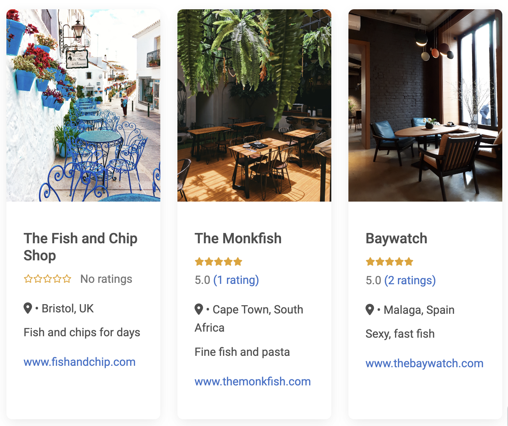
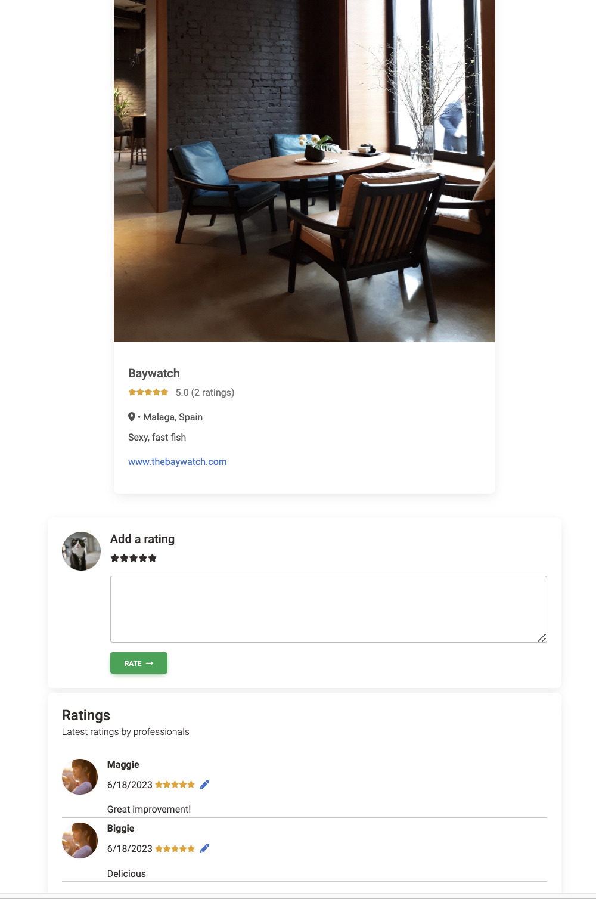

# monkfish

## Description

Monkfish is a web application that allows professionals in the food industry to rate restaurants and leave their comments.

### Screenshots

### Technologies

Node.js, Express.js, Handlebars.js, Jest, dotenv, MBD

### Link to deployed application

Coming soon...

### Monkfish is built with the following characteristics

- Use of Node.js and Express.js to create a RESTful API.
- Use of Handlebars.js as the templating engine.
- Use of MySQL and the Sequelize ORM for the database.
- Have GET, POST, PUT and DELETE routes for retrieving, adding, amending and deleting data
- Use of Jest for testing
- Use of an additional imported MBD library which provides acess to an open-source UI kits which we have not used before.
- Thanks to MBD, Monkfish has a polished UI.
- Thanks fo MBD, Monkfish is responsive.
- Is interactive (i.e., accepts and responds to user input).
- Has a folder structure that meets the MVC paradigm.
- Includes authentication (express-session and cookies).
- Use of dotenv to protect API keys and sensitive information with environment variables.
- Has a clean repository that meets quality coding standards (file structure, naming conventions, best practices for class/id naming conventions, indentation, quality comments, etc.).

### Outstanding Monkfish issues still to be completed

- Deployment using Heroku (with data)
- Password protection using bcrypt
- Debugging of editing/adding of ratings

## Learnings

- Working in a team requires open dialogue and regular updates to ensure milestones are met. We could have done much better in this regard.
- It would seem that one of the early milestones that everyone should jointly meet is to ensure that the data models are all correctly set up and associated before the team moves onto other work. It was very difficult to integrate the models and routes in hindsight.
- Writing issues is hard, some issues were small and short and others were extremely lengthy and underestimated.
- With the advent of generative AI such as chatGPT, coding and troubleshooting has become much easier and much of the learnings from this program has been about how to ask the right questions. This feels a bit uncomfortable as it feels like we are not directly learning how to code, but are rather just getting better at READING code.
- Importing libraries can introduce interactions or behaviours with unforseen consequences. For example the MBD library provided a front-end which included a mask which prevented any click event from triggering. This seemingly simple class was highly disruptive.

## Created by

Drew and Mei through great gnashing of teeth. 